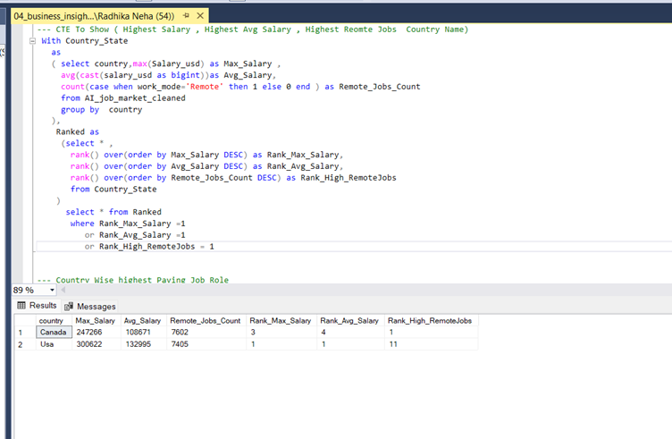
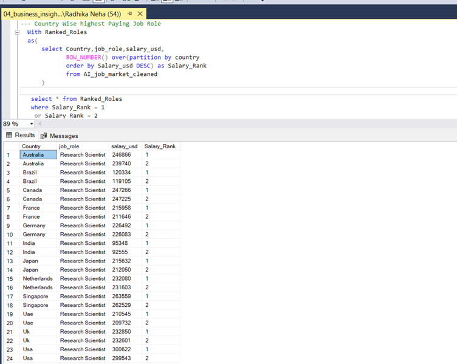

# 📊 AI Job Market SQL Analysis

## 📌 Project Overview
This project analyzes an AI job market dataset using SQL.
The objective is to extract business insights, identify trends, and understand salary patterns country wise in the AI industry.

---

## 🛠 Tools Used
- SQL Server
- Excel
- GitHub

---

## 📂 Project Structure
01_data_import.sql 
02_data_cleaning.sql
03_exploratory_analysis.sql
04_business_insights.sql  
05_query_optimization.

---
# 🤖 AI Job Market SQL Analysis  

  
  

---

## 📌 Project Overview

This project analyzes the AI Job Market dataset using **SQL Server**.  
The analysis includes data cleaning, exploratory data analysis (EDA), business insights, and performance optimization using indexes.

---

## 🛠 Tools Used
- 🗄 Microsoft SQL Server  
- 📊 SQL (T-SQL)  
- 📁 CSV Dataset  

---

## 📊 Key Analysis Results

---

### 💰 Salary Statistics (Max, Min, Average)

  

🔎 Insight:
- Identified highest and lowest salary offered.
- Calculated average salary across all roles.
- Helped understand overall salary distribution in AI job market.

---

### 🚀 Top Highest Paying Job Roles

  

🔎 Insight:
- Identified top paying AI job roles.
- Compared role-based salary distribution.
- Highlighted high-demand, high-paying positions.

---

## 📈 Key Insights
- Identified top-paying AI roles
- Analyzed most in-demand skills
- Compared remote vs on-site jobs
- Studied salary trends by Country

---

## 🚀 Skills Demonstrated
- Data Cleaning in SQL
- Aggregation & Grouping
- Subqueries
- Performance Optimization using Indexes

---

## 👩‍💻 Author
Neha Singh  
MIS Executive | SQL | Excel | VBA | Learning Python
